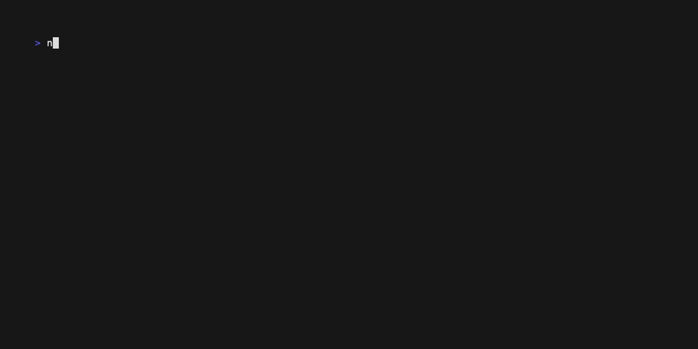

# tieline

**Static frontend↔backend contract-drift checker. Pact without writing a single contract test.**

[](https://www.npmjs.com/package/@nugehs/tieline) [](https://github.com/nugehs/tieline/actions/workflows/test.yml) [](LICENSE) [](#) [](#tests) [](#)



`tieline` reads the code you already wrote on both sides of an API boundary — the
HTTP calls your frontend makes and the routes your backend exposes — and tells you
where they disagree. No contract tests to author, no broker to run, no backend to
boot. It finishes in well under a second and is built to run in CI as a gate.

> Delete the LLM and a developer still installs it. `tieline` is a deterministic
> tool first; an agent reading its output is a bonus.

---

## How it works

```
  frontend code                                  backend code
  (axios, rtk-query, …)                          (express, nestjs, openapi, …)
        │                                                │
   client adapter                                   server adapter
        │            normalize  ${id} :id {id} → {}       │
        └───────────────►  join on (METHOD, path)  ◄──────┘
                                   │
              ✅ matched   ❌ drift   ⚠️ unverifiable   🟡 dead
```

Both sides are reduced to a canonical `(METHOD, path)` and joined. The matcher is
**adapter-agnostic** — any client adapter pairs with any server adapter, so the
same engine checks a React app against Express, an Angular app against Spring, or
anything against an OpenAPI spec.

| Result | Meaning |
| --- | --- |
| ✅ **matched** | FE call resolves to a real BE route |
| ❌ **drift** | FE call resolves but the BE has no such route/method — **the bug bucket** |
| ⚠️ **unverifiable** | FE url is built at runtime — reported, never guessed |
| 🟡 **dead** | BE route no resolvable FE call reaches (informational) |

---

## tieline vs alternatives

These tools solve neighbouring problems — pick by what you have and what you want guaranteed.

| Tool | How it works | What it catches | What it needs | Reach for it when |
| --- | --- | --- | --- | --- |
| **tieline** | Static analysis of FE call sites + BE route declarations, joined on `(METHOD, path)` | A frontend calling a route the backend doesn't expose (path/method drift), undocumented/phantom spec routes | Source code of both sides; nothing running, nothing authored | You want a sub-second CI gate with zero contract tests to write or maintain |
| **[Pact](https://pact.io)** | Consumer-driven contract tests executed at runtime, shared via a broker | Request/response **payload** mismatches between specific consumer–provider pairs | Contract tests written on both sides, a Pact broker, provider verification builds | Independent teams need payload-level guarantees and a can-I-deploy workflow |
| **[openapi-diff](https://github.com/OpenAPITools/openapi-diff)** | Diffs two OpenAPI documents | Breaking changes between two **spec versions** | Accurate specs for both versions; doesn't read source code | Your API surface is spec-first and you want to gate spec changes |
| **[Optic](https://www.useoptic.com)** | Tracks your OpenAPI spec over time and diffs every change in CI | Breaking changes and style/standards violations in the **spec's history** | An OpenAPI spec kept in the repo | You govern an evolving spec and want each PR's API changes reviewed |
| **[Schemathesis](https://schemathesis.io)** | Property-based fuzzing of a **running** API against its OpenAPI/GraphQL schema | Server crashes, schema violations, undocumented responses at runtime | A bootable backend + a schema | You want runtime conformance and robustness testing of the implementation |

They compose: tieline catches FE↔BE drift statically in every PR, `tieline doctor`
keeps code↔spec honest, and a runtime tool like Pact or Schemathesis can guard the
payload/behaviour layer underneath.

---

## Quick start

Install (or run with `npx`):

```bash
npm install -g @nugehs/tieline
# or, from a clone:  git clone … && cd tieline && npm link
```

Generate a `tieline.config.json` — `init` sniffs the surrounding directories
(cwd, its children, and its siblings) for known stacks and writes a ready-to-run
config:

```bash
tieline init
```

```
  tieline · init

  scanning ~/code for repos…
  ✔ client: rtk-query     → web   (roots: src/redux/apis)
  ✔ server: nestjs        → api   (roots: src)

  📝 wrote tieline.config.json
```

It detects adapters from `package.json` deps (`@reduxjs/toolkit`, `axios`,
`@angular/core`, `@nestjs/core`, `express`, `fastify`, `next`),
`requirements.txt` / `pyproject.toml` (`fastapi`, `flask`), `pom.xml` /
`build.gradle` (`spring`), and any OpenAPI doc as a fallback. Anything it can't
detect is written as a placeholder for you to edit. The file is always
overwritten, so re-run it whenever your layout changes.

Or write it by hand — at the root of (or above) your repos:

```jsonc
{
  "client": { "adapter": "rtk-query", "repo": "../web", "roots": ["src/redux/apis"], "basePath": "/api/v1" },
  "server": { "adapter": "nestjs",    "repo": "../api", "roots": ["src"], "globalPrefix": "api/v1" },
  "failOn": ["drift"]
}
```

Run it:

```bash
tieline check
```

```
  tieline · contract check

  ❌  2 drift  (FE calls a route the backend does not expose)
     GET    /users/{}
            getUser  ·  web/src/redux/apis/user-api.ts:42
            → did you mean "user/{}"?            # plural vs singular — a guaranteed 404
     PUT    /orders/{}
            updateOrder  ·  web/src/redux/apis/order-api.ts:88
            → path exists but as GET, not PUT    # method mismatch

  ✅ 274 matched   ❌ 2 drift   ⚠️  6 unverifiable   🟡 31 unused backend routes
```

`check` exits non-zero when any `failOn` bucket is non-empty — drop it into CI and
the build fails the moment the two sides disagree.

---

## Commands

```bash
tieline init       # auto-detect nearby repos and write tieline.config.json
tieline check      # FE↔BE drift; exits non-zero on drift (the CI gate)
tieline list       # the full resolved contract map (every endpoint + status)
tieline orphans    # backend routes no frontend call reaches
tieline doctor     # code↔spec drift (see below)
```

| Flag | Effect |
| --- | --- |
| `--config <path>` | Path to `tieline.config.json` (default: searched upward from cwd) |
| `--json` | Machine-readable output |
| `--html <file>` | Self-contained visual report (see [Visual report](#visual-report)) |
| `--no-fail` | Always exit 0 (report only) |

---

## Supported stacks

Any client adapter pairs with any server adapter — the matcher never changes.

| Client (calls) | Server (routes) |
| --- | --- |
| `rtk-query` — Redux Toolkit Query | `nestjs` — decorators |
| `axios-fetch` — axios / fetch, React Query & SWR `queryFn`s | `express` — `app.use()` mount graph, cross-file |
| `angular-http` — Angular `HttpClient` | `fastify` — verb shorthand + `route({})` |
| | `next` — file-based (app router + pages API) |
| | `fastapi` — `APIRouter` prefix + `include_router` |
| | `flask` — blueprints + `methods=[]` |
| | `spring` — `@RequestMapping` + `@*Mapping` |
| | `openapi` — **universal**: any OpenAPI 2/3 doc (file or URL) |

That covers **MERN** (rtk/axios ↔ express), **MEAN** (angular ↔ express), **MEVN**
(axios ↔ express), **Next** full-stack, **Python** (fastapi/flask), and
**enterprise** (angular ↔ spring) — plus `openapi` for any backend that emits a
spec (Express+swagger-jsdoc, FastAPI, Spring springdoc, .NET Swashbuckle, …).

Notes:

- **`express`** walks the `app.use()` mount graph across `require`/`import`
  boundaries and nested routers; routers it can't reach are flagged, never dropped.
- **`next`** is file-system routing — app-router files export `GET`/`POST`/…;
  pages-router handlers serve any verb (matched as `ALL`).
- Runtime-built urls (e.g. `` `users/${id}?x=${q}` ``) are surfaced as
  **unverifiable** rather than guessed.

---

## Configuration

`tieline.config.json` — repo paths resolve relative to the config file.

```jsonc
{
  "client": {
    "adapter": "rtk-query",      // rtk-query | axios-fetch | angular-http
    "repo": "../web",
    "roots": ["src/redux/apis"], // dirs to scan for call sites
    "basePath": "/api/v1"        // stripped from call sites before matching
  },
  "server": {
    "adapter": "nestjs",         // nestjs | express | fastify | next | fastapi | flask | spring | openapi
    "repo": "../api",
    "roots": ["src"],
    "globalPrefix": "api/v1",    // stripped from routes before matching
    "spec": "openapi.json"       // openapi adapter & `doctor` only — file path or URL
  },
  "ignore": ["internal/.*"],     // regexes on the normalized path
  "failOn": ["drift"]            // buckets that make `check` exit non-zero
}
```

---

## Visual report

`tieline check --html report.html` writes **one self-contained file** (inline
CSS/JS, no external assets) you can open in any browser or attach to a PR:

- a **contract-flow diagram** — frontend resources on the left, backend on the
  right, curved links coloured green (matched) / red (drift), with a `∅ no route`
  node catching calls that land nowhere; hover a resource to highlight its links
- a health ring, summary cards, and live-filterable drift / unverifiable / unused
  tables

---

## `tieline doctor` — does your code match your published docs?

`doctor` diffs routes parsed from source (a native adapter like `nestjs`) against
the routes declared in your OpenAPI spec (`server.spec`):

```
  tieline · doctor   code (nestjs)  ↔  spec (http://localhost:9999/doc-json)

  ❌  4 undocumented  (in code, missing from the published spec)
     GET    /billing/invoices       src/billing/billing.controller.ts:54
     POST   /webhooks/stripe        src/webhooks/webhooks.controller.ts:21
     ...
  👻  1 phantom  (in the spec, no matching route in code)

  ✅ 312 agree   ❌ 4 undocumented   👻 1 phantom   (316 code routes, 313 spec routes)
```

- **undocumented** — working routes invisible to anyone generating an SDK or
  partner integration from the spec.
- **phantom** — the spec promises a route the code no longer serves (stale docs).

Run it alongside `check` and your spec can never silently drift from your code.

---

## Use as an MCP server

tieline ships an [MCP](https://modelcontextprotocol.io) server so an agent can ask
"do these two repos still agree?" and get the same structured result the CLI
produces — **no LLM does the analysis, the deterministic engine does**. It's still
zero-dependency: the server is hand-rolled stdio JSON-RPC, no SDK.

Register it with any MCP client (Claude Code, Claude Desktop, …):

```jsonc
{
  "mcpServers": {
    "tieline": { "command": "npx", "args": ["-y", "-p", "@nugehs/tieline", "tieline-mcp"] }
  }
}
```

Or, from a global install (`npm i -g @nugehs/tieline`), just `"command": "tieline-mcp"`.

It exposes five tools, each returning JSON:

| Tool | Args | Returns |
| --- | --- | --- |
| `tieline_check` | `config?` | totals + `drift` + `unverifiable` (the drift gate) |
| `tieline_list` | `config?` | the full resolved contract map |
| `tieline_orphans` | `config?` | backend routes no frontend call reaches |
| `tieline_doctor` | `config?` | `undocumented` + `phantom` (code ↔ spec) |
| `tieline_init` | `cwd?` | auto-detect nearby repos, write a config |

`config` defaults to searching upward from the server's working directory, exactly
like the CLI — so an agent dropped into a repo with a `tieline.config.json` can
just call `tieline_check`.

---

## Architecture

Each side implements a single extractor; everything downstream is shared.

```
ClientAdapter.extract() → Endpoint[] { method, rawPath, resolvable, file, line }
ServerAdapter.extract() → Route[]    { method, rawPath, file, line }
```

A new framework is a new adapter (~80 lines) — the normalizer, matcher, reporters,
and CLI never change. Path-existence drift ships today; OpenAPI **DTO-shape**
diffing (`--deep`) and SARIF/PR annotations are on the roadmap.

---

## Tests

```bash
npm test    # node --test — zero dependencies, nothing to install
```

71 tests on Node's built-in runner:

- **normalize** — every param syntax (`${id}`/`:id`/`<int:id>`/`[id]`/`{id}`),
  query stripping, basePath, path joining
- **matcher** — all four buckets, drift hints (method-mismatch, "did you mean"),
  `ignore`, `ALL`/`ANY` any-verb routes, cross-syntax param matching
- **adapters** — every client + server adapter against a fixture, plus edge cases
  via throwaway temp repos (Express `app.all` + unmounted router, Next route groups
  + catch-all, Spring `@RequestMapping(method=…)`, Flask default-GET, runtime urls
  → unverifiable, non-HttpClient `.get()` ignored)
- **openapi** — `servers[].url` prefix, Swagger 2 `basePath`, `stripPrefix`
- **doctor** — undocumented / phantom / matched + hints
- **init** — stack auto-detection (node deps, Python, Spring, OpenAPI fallback),
  dir-name bias, sibling/child scanning, placeholder fallback, config round-trip
- **integration** — three cross-stack proofs (RTK↔Express, Angular↔Spring,
  axios↔FastAPI) and the real CLI (exit codes, `--json`, `--html`, `doctor`)
- **mcp** — the stdio JSON-RPC server: handshake, `tools/list`, a real
  `tieline_check` over a fixture, in-band tool errors, method-not-found

---

## Roadmap

- **SARIF output** — inline drift annotations on GitHub PRs
- **`--deep`** — diff request/response **DTO shapes**, not just paths, via OpenAPI
  (catches a renamed field or changed enum, where the expensive bugs live)
- **More adapters** — `react-query`/`swr` first-class clients, `koa`/`django` servers
- **AST extraction** — replace regex parsing for exotic declarations

Known limits today: regex-based extraction (robust on conventional code), one
`@Controller` per file, path/method existence only. GraphQL is out of scope.

---

## License

MIT © Segun Olumbe

---

## Part of the toolchain

**tieline** is one of four tools that form a deterministic trust layer for AI-assisted development. Each answers a question people keep handing to an LLM — with static analysis instead.

- [repoctx](https://www.npmjs.com/package/@nugehs/repoctx) — context: what does this change actually touch?
- **tieline** (this tool) — contracts: did the front end and back end quietly stop agreeing?
- [bouncer](https://www.npmjs.com/package/@nugehs/bouncer) — compliance: could you defend this to Ofcom?
- [aiglare](https://www.npmjs.com/package/@nugehs/aiglare) — governance: where can the model do something you can't undo?

More at [segunolumbe.com](https://segunolumbe.com). *static analysis, never the model.*
